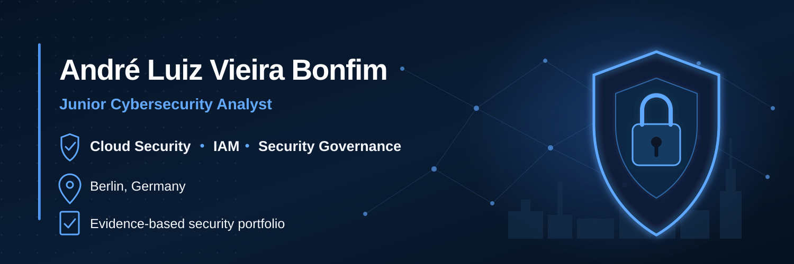

  

<h1 align="center">André Luiz Vieira Bonfim</h1>

  <strong>Cybersecurity · Secure AI · Cloud Security · IAM · Security Automation · Security Governance</strong> 
  Berlin, Germany · Evidence-driven security engineering and human-accountable AI

  <a href="https://www.linkedin.com/in/andr%C3%A9-bonfim">LinkedIn</a> ·
  <a href="https://tryhackme.com/p/a.bonfim.tech">TryHackMe</a> ·
  <a href="https://www.coursera.org/user/387e903d6f45f8fb94e4fa3725859059">Coursera</a>

## Professional Profile

Cybersecurity professional based in Berlin focused on **Secure AI, Cloud Security, Identity & Access Management (IAM), Security Operations, Security Automation and evidence-driven Security Governance**.

I build security work around a consistent engineering principle: **claims should be supported by reproducible technical evidence, explicit scope, documented limitations, traceable decisions and human accountability.** My portfolio therefore emphasizes not only what a system can do, but also **who is authorized to act, under which boundaries, how the action is verified and what evidence remains afterward**.

My practical work includes officer-bound AI-agent authorization architecture, governed Python SDK engineering, cloud-security evidence cases, security/compliance automation, SOC-oriented network analysis and audit-ready control assessment.

## Professional Cybersecurity Training — Completion Certificate

**MSIT GmbH — Master School Institute of Technology**

| Certificate field | Official information |
| --- | --- |
| **Course** | **Cybersecurity Bootcamp** |
| **Duration** | **2,720 instructional hours · June 3, 2025 – August 3, 2026** |
| **Specialization** | **Security Operations Center Analysis** |
| **Internship** | **8 weeks · 320 hours** |
| **Credential ID** | `43529502854875` |
| **Issue Date** | `July 28, 2026` |

The course title **Cybersecurity Bootcamp** and specialization **Security Operations Center Analysis** are preserved exactly as stated on the completion certificate; descriptive German labels from the certificate are rendered here in English for consistency across the profile.

<strong>Selected curriculum documented on the certificate</strong>

- IT Support Fundamentals: Hardware, Software, Networking Troubleshooting
- Operating Systems: Windows & Linux Administration
- Network Architecture & Security: Firewalls, VPNs and Segmentation
- Cyber Threats Vulnerabilities & Mitigation Strategies
- Security Tools: SIEM, EDR, Packet Analysis, Forensics Basics
- Risk Management Governance & Compliance: NIST, ISO, GDPR, HIPAA
- Identity & Access Management (IAM): MFA and Authentication Protocols
- Data Security: Encryption, PKI and Secure Disposal Practices
- System Hardening, Patch Management and Secure Configurations
- Intro to SQL, Bash, Python Scripting and Automation
- Incident Response, Business Continuity and Disaster Recovery
- Virtualization & Cloud Fundamentals: IaaS, SaaS, VMs and Containers
- Advanced Network Design and Troubleshooting
- Network Defense and Secure Architecture
- Solo Project: Secure Network Implementation and Monitoring
- Internship: 8 weeks, 320 hours

## Flagship Portfolio — Recruiter Fast Path

These are the six repositories I recommend reviewing first. They are deliberately ordered to demonstrate complementary evidence across **Secure AI, software engineering, GRC, cloud security and SOC work**.

| Priority | Project | Primary hiring signal |
| ---: | --- | --- |
| **#1** | **[Officer-Bound Digital Investigation Agent](https://github.com/a-bonfim-tech/officer-bound-digital-investigation-agent)** | Secure AI / agent authorization, human accountability, IAM boundaries, threat modeling, Go, DevSecOps, evidence engineering and governed security architecture. |
| **#2** | **[Bonfim SDK](https://github.com/a-bonfim-tech/bonfim-sdk)** | Governed Python SDK for auditable security Skills, Agents and Automations; strict typing, testing, SAST, SBOM, secret scanning, packaging and build provenance. |
| **#3** | **[AI SaaS Security & Compliance Fit-Gap](https://github.com/a-bonfim-tech/ai-saas-security-compliance-fit-gap-public)** | TypeScript security/compliance automation spanning NIST CSF, ISO 27001, SOC 2, GDPR, EU AI Act and OWASP-oriented evidence assessment. |
| **#4** | **[GCP Security Study Cases](https://github.com/a-bonfim-tech/gcp-security-study-cases)** | Evidence-backed GCP security cases covering Cloud Armor, Cloud NGFW, BeyondCorp, CMEK/KMS, logging, monitoring and VPC Flow Logs. |
| **#5** | **[TShark SOC Case Study](https://github.com/a-bonfim-tech/tshark-teamwork-soc-case-study)** | Network forensics, phishing detection, HTTP analysis, IOC extraction and threat-intelligence correlation using a SOC-style workflow. |
| **#6** | **[Human SIEM Cybersecurity](https://github.com/a-bonfim-tech/human-siem-cybersecurity)** | Security decision engineering, detection strategy, governance, SOC reasoning and audit-oriented documentation. |

For role-specific navigation and the wider repository classification, see [PORTFOLIO_INDEX.md](PORTFOLIO_INDEX.md).

## Recruiter Snapshot — Evidence I Can Show

| Domain | Evidence represented in the portfolio |
| --- | --- |
| **Secure AI & Agent Security** | Human-bound authorization, default-deny execution, agent governance, secure automation and explicit authority boundaries |
| **Cloud Security** | Azure and Google Cloud controls, IAM, network exposure, encryption, logging, monitoring and risk decisions |
| **Identity & Access Management** | MFA, privileged access, least privilege, RBAC/ABAC, Zero Trust and identity-first security models |
| **Security Operations** | Network traffic analysis, IOC extraction, investigation structure, SIEM concepts and incident-response fundamentals |
| **Security Governance / GRC** | Control assessment, evidence management, audit readiness, risk communication, GDPR, ISO 27001 and NIST-aligned reasoning |
| **DevSecOps / Supply Chain** | GitHub Actions, CodeQL, SAST, SBOM, vulnerability scanning, secret detection, branch protection and provenance |
| **Security Automation** | Python, TypeScript, Bash and deterministic evidence/report generation |

## Practical Experience — Panos.AI

**Cybersecurity Intern — Berlin**  
**8 weeks · 320 hours**

- Assessed and documented cloud-security controls focused on encryption, IAM, logging, monitoring, backup and recovery.
- Supported GDPR and ISO/IEC 27001-oriented compliance activities through evidence collection and technical control validation.
- Reviewed TLS 1.3, HTTPS/HSTS and Microsoft Azure Storage encryption controls.
- Evaluated MFA, privileged access, audit trails and monitoring controls.
- Contributed to audit-ready technical documentation and Git-based review workflows.

## Selected Technical Skills

`Python` · `Go` · `TypeScript` · `Bash` · `Microsoft Azure` · `Google Cloud` · `IAM` · `MFA` · `Zero Trust` · `TLS 1.3` · `PKI` · `GitHub Actions` · `CodeQL` · `SBOM` · `SAST` · `TShark` · `Wireshark` · `Nmap` · `Linux` · `Security Automation` · `Threat Modeling`

## Frameworks and Methods

`GDPR` · `ISO/IEC 27001 fundamentals` · `NIST Cybersecurity Framework 2.0` · `SOC 2 concepts` · `EU AI Act` · `OWASP` · `OWASP WSTG` · `OWASP Top 10` · `PTES`

## Selected Credentials and Learning Evidence

- **MSIT — Cybersecurity Bootcamp — 2,720 instructional hours — Security Operations Center Analysis**
- Google Cybersecurity Professional Certificate
- Security in Google Cloud coursework and specialization certificates
- Google Cloud networking and Cloud NGFW training
- Generative AI: Governance, Policy, and Emerging Regulation — University of Michigan
- TryHackMe cybersecurity labs and learning paths

## Portfolio Evidence Standard

Every anchor project should make the following clear:

1. Scope and authorization
2. Individual contribution
3. Methodology and tools
4. Reproducible execution or validation steps
5. Technical evidence and findings
6. Risk interpretation and limitations
7. Security and privacy safeguards
8. Human decision boundaries where automation or AI is involved

## Current Engineering Priorities

1. Preserve the OBDIA `v0.1.x` bounded reference slice as the stable security baseline and evolve a separate `v0.2.x` productionization architecture track.
2. Elevate Bonfim SDK through a release-hardening track, followed by a later isolated-execution architecture line.
3. Harden the AI SaaS Security & Compliance Fit-Gap project as the primary GRC / AI-governance portfolio anchor.
4. Strengthen GCP cloud-security evidence with reproducible, sanitized IAM and control-validation artifacts.
5. Expand SOC evidence with detection logic, investigation timelines and mapped response decisions.

## Languages

Portuguese — native · German — professional working proficiency · English — working proficiency

## Security and Responsible Disclosure

Public repositories use authorized labs, synthetic data or sanitized examples. No active credentials, customer data, employer-owned internal identifiers or production secrets should be published.

Security concerns related to this profile repository can be reported according to [SECURITY.md](SECURITY.md).
