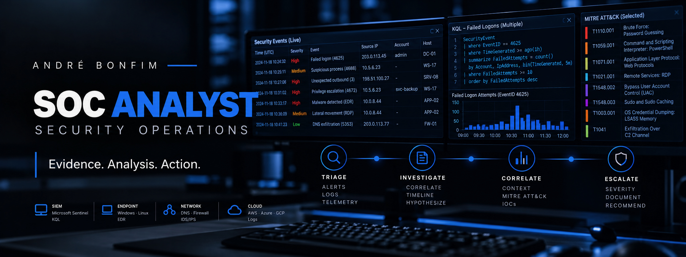

  

# André Bonfim — SOC / Junior Cybersecurity

Berlin, Germany · Seeking a first professional SOC Analyst / Tier 1 or Junior Cybersecurity role.

My portfolio demonstrates hands-on **SOC investigation, alert triage, detection, timeline reconstruction, escalation, and supporting security engineering** through controlled laboratories, reproducible exercises, and documented evidence.

## SOC / Junior Cybersecurity — Start Here

1. **[SOC Analyst Lab — investigations, detection and escalation](https://github.com/a-bonfim-tech/soc-analyst-lab)**: public SOC portfolio with evidence-bounded investigations, timelines, authentication analysis, severity and Tier 2 escalation reasoning, plus Windows Security/Sysmon investigation artifacts, Sigma rules and KQL source.
2. **[Detection and analyst review — public homelab](https://github.com/a-bonfim-tech/cybersecurity-private-cloud-homelab)**: retained Suricata alert, Wazuh native rule-test output, negative controls and native PF evidence.
3. **[Linux workstation evidence](https://github.com/a-bonfim-tech/kali-devsecops-baseline)**: dated Linux security-state collection and scripts.
4. **[Network investigation](https://github.com/a-bonfim-tech/tshark-teamwork-soc-case-study)**: guided packet-analysis case covering phishing traffic and IOC extraction.
5. **[TLS evidence](https://github.com/a-bonfim-tech/security-plus-crypto-lab)**: retained TLS handshake and certificate analysis artifacts.

The dedicated [SOC Analyst Lab](https://github.com/a-bonfim-tech/soc-analyst-lab) is now a public review path. It includes controlled Linux authentication evidence and synthetic Windows Security/Sysmon-style investigation artifacts, with Sigma parsing and KQL source kept within explicit execution boundaries. Real Windows endpoint evidence, retained KQL-runtime results and an executed cloud-SOC investigation remain gaps.

[Portfolio index](PORTFOLIO_INDEX.md) · [Safe CV / LinkedIn evidence map](SOC_PORTFOLIO_TO_CV_MAP.md)

## How I approach an alert

Validate the source and time window; preserve evidence; identify the account and asset; correlate related activity; test benign explanations; distinguish observations from hypotheses; document severity and uncertainty; escalate within authority. The linked artifacts show which parts are demonstrated and which remain planned.

## Learning and contact

[LinkedIn](https://www.linkedin.com/in/andr%C3%A9-bonfim) · [TryHackMe](https://tryhackme.com/p/a.bonfim.tech) · [Coursera](https://www.coursera.org/user/387e903d6f45f8fb94e4fa3725859059)

## Professional Cybersecurity Training — Completion Certificate

**MSIT GmbH — Master School Institute of Technology**

| Certificate field | Official information |
| --- | --- |
| **Course** | **Cybersecurity Bootcamp** |
| **Duration** | **2,720 instructional hours · June 3, 2025 – August 3, 2026** |
| **Specialization** | **Security Operations Center Analysis** |
| **Internship** | **8 weeks · 320 hours** |
| **Credential ID** | `43529502854875` |
| **Issue Date** | `July 28, 2026` |

The course title **Cybersecurity Bootcamp** and specialization **Security Operations Center Analysis** are preserved exactly as stated on the completion certificate; descriptive German labels from the certificate are rendered here in English for consistency across the profile.

<strong>Selected curriculum documented on the certificate</strong>

- IT Support Fundamentals: Hardware, Software, Networking Troubleshooting
- Operating Systems: Windows & Linux Administration
- Network Architecture & Security: Firewalls, VPNs and Segmentation
- Cyber Threats Vulnerabilities & Mitigation Strategies
- Security Tools: SIEM, EDR, Packet Analysis, Forensics Basics
- Risk Management Governance & Compliance: NIST, ISO, GDPR, HIPAA
- Identity & Access Management (IAM): MFA and Authentication Protocols
- Data Security: Encryption, PKI and Secure Disposal Practices
- System Hardening, Patch Management and Secure Configurations
- Intro to SQL, Bash, Python Scripting and Automation
- Incident Response, Business Continuity and Disaster Recovery
- Virtualization & Cloud Fundamentals: IaaS, SaaS, VMs and Containers
- Advanced Network Design and Troubleshooting
- Network Defense and Secure Architecture
- Solo Project: Secure Network Implementation and Monitoring
- Internship: 8 weeks, 320 hours

Certificate transcription is preserved from the prior profile; this remediation did not independently authenticate the issuer or convert training/internship hours into production SOC employment.
