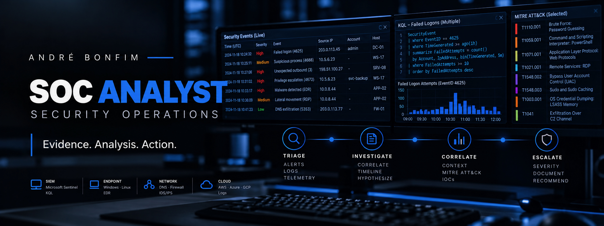

  

# André Bonfim — SOC Analyst | Security Operations

**Microsoft Defender · Microsoft Sentinel · EDR/SIEM Investigation · Phishing · Incident Investigation · Windows**

Investigated **endpoint, EDR/SIEM, phishing and network cases**; correlated evidence, reconstructed activity, reassessed severity, and documented escalation or closure decisions.

## SOC Analyst Portfolio — Start Here

**Primary investigation portfolio → [SOC Analyst Lab](https://github.com/a-bonfim-tech/soc-analyst-lab)**

### 1. [SOC Analyst Lab](https://github.com/a-bonfim-tech/soc-analyst-lab)
Investigated Defender/XDR, Sentinel, Windows/network and phishing cases; correlated evidence, reassessed severity, resolved authorized lab activity, and escalated unresolved phishing risk to Tier 2.

### 2. [Cybersecurity Private Cloud Homelab](https://github.com/a-bonfim-tech/cybersecurity-private-cloud-homelab)
Validated native PF segmentation, routing, NAT and allow/deny behavior; Suricata and Wazuh detections passed positive and bounded negative tests.

### 3. [TShark Teamwork SOC Case Study](https://github.com/a-bonfim-tech/tshark-teamwork-soc-case-study)
Independent TShark network analysis with a reproducible synthetic PCAP and retained outputs for independent verification, alongside clearly separated historical TryHackMe training.

<strong>Supporting security projects</strong>

- [Kali DevSecOps Baseline](https://github.com/a-bonfim-tech/kali-devsecops-baseline) — collected dated Linux security-state evidence covering firewall, services and authentication, with repeatable baseline outputs retained for review.
- [Security+ Crypto Lab](https://github.com/a-bonfim-tech/security-plus-crypto-lab) — retained TLS handshake and certificate-analysis evidence.

Evidence scope: controlled laboratories and reproducible evidence.

[Portfolio index](PORTFOLIO_INDEX.md) · [CV / LinkedIn evidence map](SOC_PORTFOLIO_TO_CV_MAP.md)

## Open Source Contribution

**Velociraptor — merged upstream contribution**
Fixed offline collector logic so artifact sources with false preconditions are skipped as intended, with regression coverage ([PR #5046](https://github.com/Velocidex/velociraptor/pull/5046)).

## How I approach an alert

Validate the source and time window; preserve evidence; identify the account and asset; correlate related activity; test benign explanations; distinguish observations from hypotheses; assess severity; document findings and uncertainty; escalate when appropriate.

## Professional Cybersecurity Experience

### Panos.AI — Cybersecurity Intern
**June–August 2026 · 320 hours**

- Defined security-control evaluation criteria and reviewed technical evidence for encryption in transit and at rest, including HTTPS/TLS, certificate validation, HTTP-to-HTTPS redirection and HSTS.
- Assessed evidence sufficiency and distinguished observed results from unsupported conclusions; worked with Python, JSON, JSON Schema, automated tests and Markdown in a GitHub repository with tasks tracked in Linear.
- Implementation and testing were AI-assisted, with evaluation criteria, evidence review and conclusions remaining under human direction and critical review.

## Contact & Continued Development

[LinkedIn](https://www.linkedin.com/in/andr%C3%A9-bonfim)

Continued development: [TryHackMe](https://tryhackme.com/p/a.bonfim.tech) · [Coursera](https://www.coursera.org/user/387e903d6f45f8fb94e4fa3725859059)

## Training & Credentials

**MSIT GmbH — Cybersecurity Bootcamp · Security Operations Center Analysis**
2,720 instructional hours · June 3, 2025 – August 3, 2026
